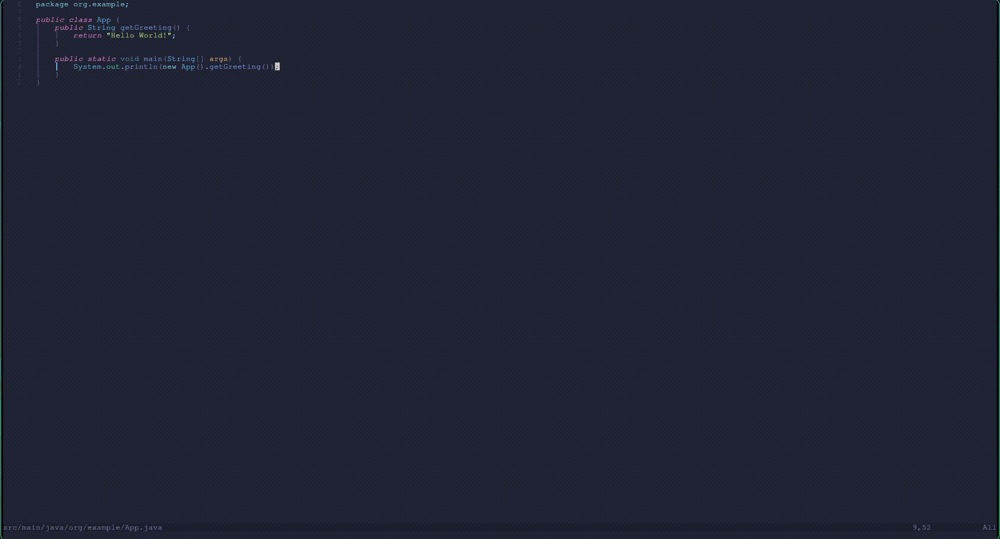

<div align="center">

# ☕ file-creator.nvim

### *Blazing fast, LSP-aware, zero-friction Java scaffold engine for Neovim.*

[](https://neovim.io)
[](https://www.lua.org)
[](tests/)
[](LICENSE)

Stop manually typing `package com.enterprise.service.impl;`, creating 6 nested directories by hand, copying license headers, and triggering LSP organize-imports. 

**`file-creator.nvim` handles the ceremony so you can write actual code.**

[Features](#-features) • [Installation](#-installation) • [Usage](#-commands--usage) • [Configuration](#%EF%B8%8F-configuration) • [How It Works](#-under-the-hood)

</div>

---

## ✨ Features

- ⚡ **Snacks.nvim Native Picker** — Create any Java file (Class, Interface, Record, Enum) on the fly with live search, or fall back smoothly to `vim.ui.select`.
- 🧩 **Interactive Inheritance & Typing** — Effortlessly prompt for `extends` and `implements` clauses with instant template expansion.
- 🌲 **Deep Gradle & Multi-Module Resolution** — Automatically resolves root projects (`settings.gradle[.kts]`, `build.gradle[.kts]`, `.git`) and calculates exact package paths (`com.foo.bar`) without manual configuration.
- 🧪 **Instant Test Generation (`:CreateTest`)** — One command mirrors `src/main/java/.../Foo.java` directly to `src/test/java/.../FooTest.java`, wiring up directories and packages instantly.
- 📜 **Upward License Crawling** — Traverses parent directories to discover `LICENSE` files and formats them cleanly into Java block comments at the top of new files.
- 🛡️ **Strict JLS Identifier Validation** — Validates paths and class names before writing to disk, preventing syntax errors from Java keywords (`goto`, `assert`, `_`), literals (`null`, `true`), and restricted type identifiers (`var`, `record`, `yield`).
- 🔄 **LSP Auto-Wiring** — Automatically triggers `jdtls.organize_imports` and LSP formatting on buffer attach.

---

## ⚡ Showcase Workflow

```
:CreateJavaFile
 ├── Type: "service/auth/TokenAuthService"
 ├── Pick: Class
 ├── Prompt: Super class (extends)    -> BaseAuthService
 └── Prompt: Interfaces (implements)  -> Authenticator, Closeable
```

**Resulting generated file (`src/main/java/com/app/service/auth/TokenAuthService.java`):**
```java
/*
 * Copyright (c) 2026 Enterprise Corp.
 * All rights reserved.
 */
package com.app.service.auth;

public class TokenAuthService extends BaseAuthService implements Authenticator, Closeable {
    
}
```
*LSP `organize_imports` and formatting run automatically in the background.*

---

## 📋 Requirements

- Neovim 0.10+
- `folke/snacks.nvim`
- `nvim-java` / `jdtls`

## 📦 Installation

Install with your preferred Neovim package manager.

### [lazy.nvim](https://github.com/folke/lazy.nvim)

```lua
{
    "omniCoder77/file-creator.nvim",
    dependencies = {
        "folke/snacks.nvim",
    },
    cmd = {
        "CreateJavaFile",
        "CreateJavaClass",
        "CreateJavaInterface",
        "CreateJavaEnum",
        "CreateJavaRecord",
        "CreateTest",
    },
    opts = {},
}
```

---

## 🚀 Commands & Usage

| Command | Arguments | Description |
|---|---|---|
| `:CreateJavaFile` | None | Opens the interactive Java creation wizard for selecting type, name, inheritance, and interfaces. |
| `:CreateJavaClass` | `[name]` *(optional)* | Creates a standard Java `class`. Prompts for `extends` & `implements`. |
| `:CreateJavaInterface` | `[name]` *(optional)* | Creates a Java `interface`. Prompts for `extends`. |
| `:CreateJavaEnum` | `[name]` *(optional)* | Creates an `enum`. Prompts for `implements`. |
| `:CreateJavaRecord` | `[name]` *(optional)* | Creates a modern Java `record`. Prompts for `implements`. |
| `:CreateTest` | None | Reads current Java file and scaffolds companion unit test in `src/test/java`. |

### Command-Line Shortcuts

You can pass relative directory paths and omit `.java`:

```vim
" Creates src/main/java/<package>/dto/request/LoginRequest.java
:CreateJavaRecord dto/request/LoginRequest

" Creates src/main/java/<package>/repository/UserRepository.java
:CreateJavaInterface repository/UserRepository
```

---

## ⚙️ Configuration

`file-creator.nvim` comes with fully functional defaults out of the box. You can customize templates, source directories, and license headers:

```lua
require("file-creator").setup({
    -- Recognized source directories for package resolution
    java_source_dirs = { "src/main/java" },
    
    -- Target test directories mapped 1:1 with source dirs
    java_test_dirs = { "src/test/java" },
    
    -- Custom file templates
    templates = {
        Class     = "public class ${name}${extends}${implements} {\n    \n}\n",
        Interface = "public interface ${name}${extends} {\n    \n}\n",
        Enum      = "public enum ${name}${implements} {\n    \n}\n",
        Record    = "public record ${name}()${implements} {\n    \n}\n",
        Test      = "public class ${name} {\n    \n}\n",
    },
    
    -- License banner extraction
    license = {
        enabled = true,
        filenames = { "LICENSE", "LICENSE.txt", "LICENSE.md" },
    },
    
    -- LSP Post-Creation actions
    should_format = true,       -- Run vim.lsp.buf.format on new files
    organize_imports = true,    -- Run jdtls.organize_imports / code actions
})
```


| Option              | Default                                | Description                              |
| ------------------- | -------------------------------------- | ---------------------------------------- |
| `java_source_dirs`  | `{"src/main/java"}`                    | Java source roots                        |
| `java_test_dirs`    | `{"src/test/java"}`                    | Test roots corresponding to source roots |
| `templates`         | built-in templates                     | Custom Java templates                    |
| `license.enabled`   | `true`                                 | Enable license discovery                 |
| `license.filenames` | `LICENSE`, `LICENSE.txt`, `LICENSE.md` | License filenames to search              |
| `should_format`     | `true`                                 | Format newly created files               |
| `organize_imports`  | `true`                                 | Organize imports when supported          |

---

## 🧠 Under The Hood

```
┌─────────────────────────────────────────────────────────────┐
│                     User Input / Picker                     │
└──────────────────────────────┬──────────────────────────────┘
                               │
            ┌──────────────────┴──────────────────┐
            ▼                                     ▼
┌───────────────────────┐             ┌───────────────────────┐
│   Strict Validation   │             │   Inheritance Prompt  │
│  - No Java Keywords   │             │  - extends / impls    │
│  - Spec Type Ident    │             │  - Auto-formatting    │
└───────────┬───────────┘             └───────────┬───────────┘
            │                                     │
            └──────────────────┬──────────────────┘
                               ▼
            ┌─────────────────────────────────────┐
            │       Root & Package Engine         │
            │  - settings.gradle[.kts] traversal  │
            │  - Multi-module package calculator  │
            └──────────────────┬──────────────────┘
                               ▼
            ┌─────────────────────────────────────┐
            │        License Header Banner        │
            │  - Recursive upward root finder     │
            │  - Formatted Javadoc block comment  │
            └──────────────────┬──────────────────┘
                               ▼
            ┌─────────────────────────────────────┐
            │         File I/O + LSP Sync         │
            │  - Write file & mkdir -p            │
            │  - Buffer open & LspAttach Hook     │
            │  - organize_imports + format        │
            └─────────────────────────────────────┘
```

1. **Package Calculation**: Analyzes current working buffer, scans for standard Gradle/Git roots, slices matching source roots (`src/main/java`), and converts path delimiters (`/`) into valid Java package identifiers (`com.example.service`).
2. **Identifier Safety**: Enforces the Java Language Specification (JLS). Rejects illegal tokens like `2Service`, `void`, `yield`, `class/package/BadName`, preventing broken project states.
3. **Smart Async LSP Attach**: If your LSP client (`jdtls`) isn't active on buffer creation, `file-creator.nvim` creates a one-time `LspAttach` autocommand to format and organize imports once the server is ready.

---
## ⚡ Showcase


---

## 📄 License
Distributed under the MIT License. See [`LICENSE`](LICENSE) for more information.
MIT © 2026
